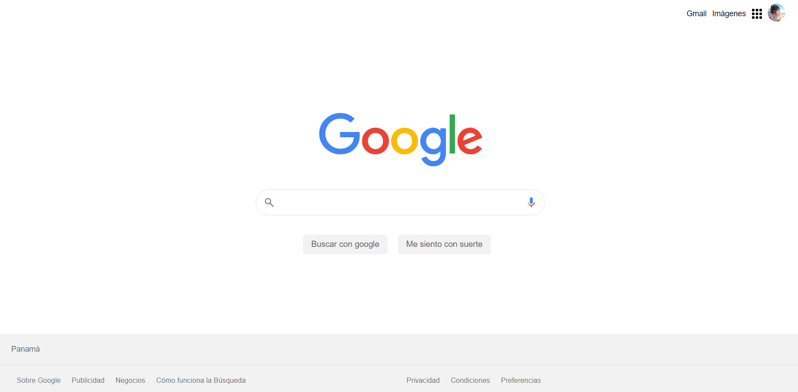
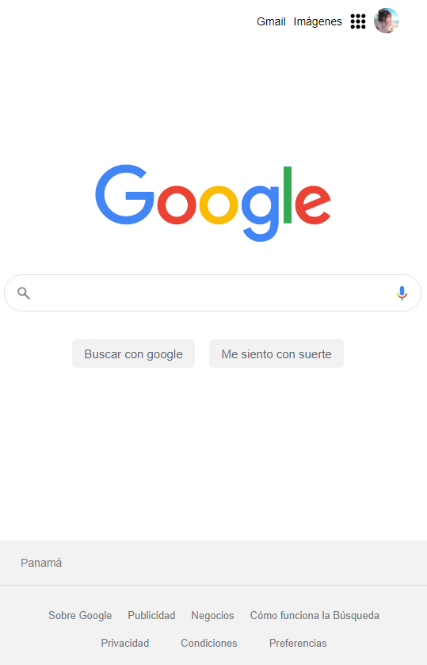

# Clon del diseño de Google
Desarrollo del diseño utilizado en el buscador Google con HTML5 y CCS3.  Aplicando flexbox, grid y media query para el responsive

## Proyecto de Platzi
- [Curso Práctico de HTML y CSS](https://platzi.com/clases/html-practico/)
- [Certificado del curso](https://platzi.com/p/gabycarol04/curso/1758-html-practico/diploma/detalle/)

## Diseño Responsive
Utilizando Media Query
### 1. Escritorio

### 2. Movil

